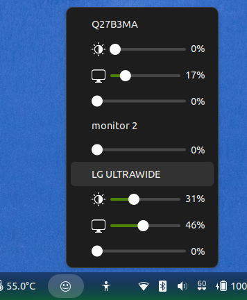

## Set Monitor DDC Brightness/Contrast + Extra Dimming



### Installation and Configuration

#### Install ddcutil
```
sudo apt install ddcutil
```

#### Make sure i2c-dev is loaded
After installing ddcutil, make sure i2c-dev is loaded:
```
sudo modprobe i2c-dev
```
or add i2c-dev to the /etc/modules file.  
(More info: https://www.ddcutil.com/config_steps/)

#### Add your user to group i2c
```
sudo usermod -aG i2c $USER
```
(More info: https://www.ddcutil.com/i2c_permissions_using_group_i2c/)

#### You can check if its working by trying:
```
ddcutil detect
```

#### More info:
https://www.ddcutil.com/install_config_main/

#### Install this GNOME extension
Last but not least, get this extension here: [Monitor DDC Brightness/Contrast + Extra Dimming](https://extensions.gnome.org/extension/6985/set-monitor-ddc-brightnesscontrast-extra-dimming/)  
(Also available from your Extension Manager.)

#### Log out / Log in
You need to log out/log in after doing all the installation and configuration procedure for this extension to work.
